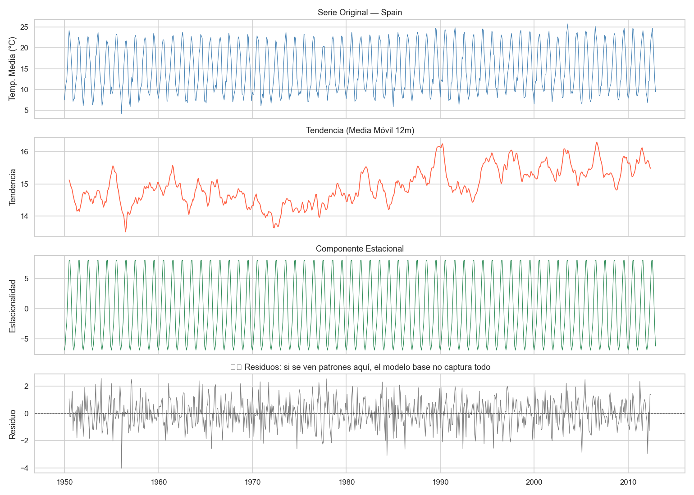
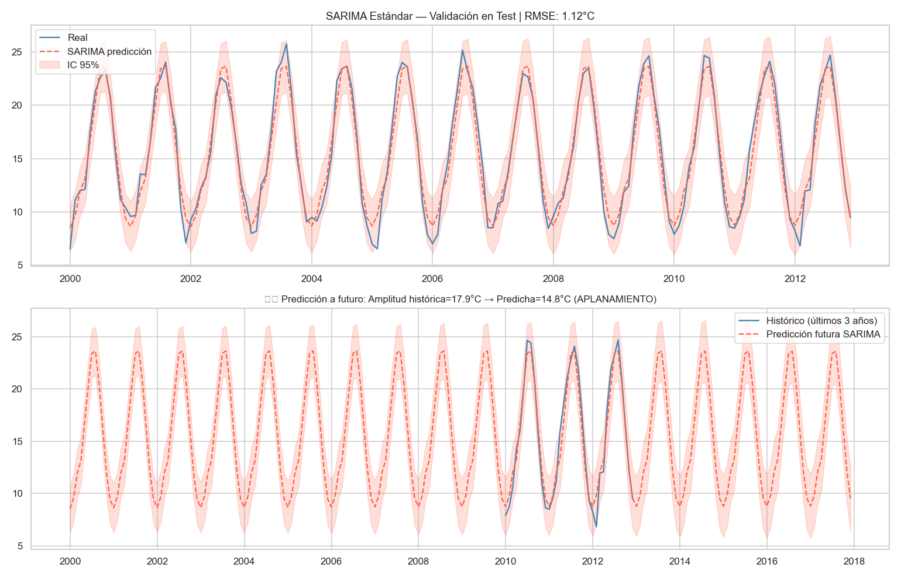
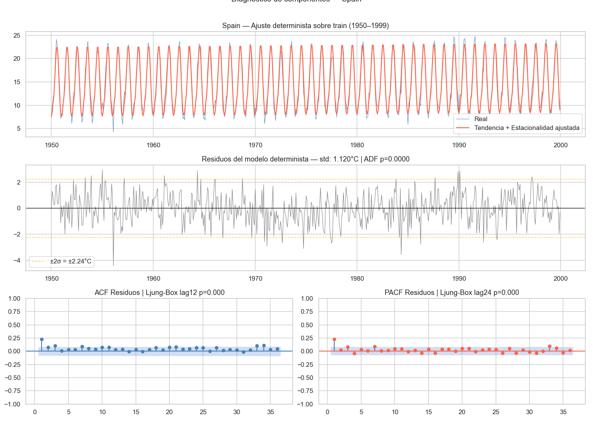
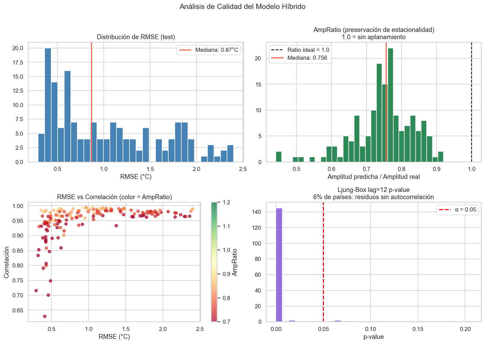
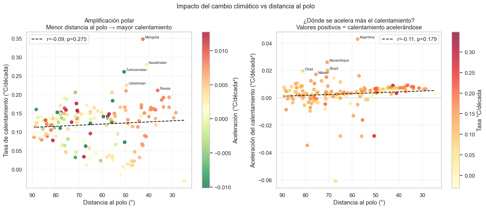
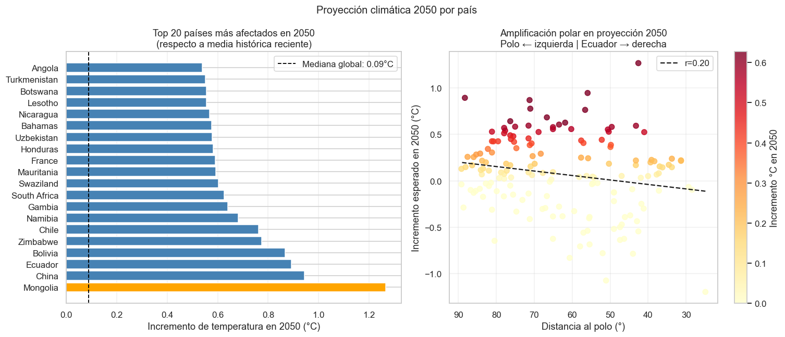

# Proyecto de Predicción Climática con Modelos Híbridos

Este proyecto analiza y predice temperaturas medias mensuales por país utilizando series temporales y modelos de machine learning híbridos. Combina componentes deterministas (tendencia lineal + estacionalidad mensual) con modelos ARIMA para capturar la autocorrelación residual.

## Descripción del Proyecto

El objetivo principal es desarrollar modelos precisos para predecir el cambio climático a nivel nacional, abordando el problema del "aplanamiento" en predicciones SARIMA tradicionales. Los modelos híbridos logran una mejor preservación de la amplitud estacional y mayor precisión en predicciones a largo plazo.

### Características Principales

- **Análisis Exploratorio**: Descomposición de series temporales en tendencia, estacionalidad y ruido.
- **Modelos Híbridos**: Combinación de regresión lineal para componentes deterministas + ARIMA para residuos.
- **Validación Extensiva**: Métricas como RMSE, MAE, correlación y preservación de estacionalidad.
- **Predicciones Futuras**: Proyecciones hasta 2050 considerando aceleración del calentamiento.
- **Amplificación Polar**: Análisis de cómo el cambio climático afecta más a países cercanos a los polos.

## Estructura del Proyecto

```
├── index.py                 # Aplicación principal (Streamlit)
├── mi_eda.py                # Análisis exploratorio de datos
├── requirements.txt         # Dependencias de Python
├── data/
│   └── tiempoDS.csv.gz      # Dataset de temperaturas (Berkeley Earth)
├── img/                     # Imágenes generadas
├── models/
│   └── modelos_hibridos_v2/ # Modelos entrenados por país (.joblib)
├── notebooks/
│   ├── temporalSeriesWeather_v2.ipynb  # Notebook principal de modelado
│   └── otros notebooks...
└── pages/                   # Páginas de Streamlit
    ├── About_Us.py
    ├── EDA.py
    └── prediction.py
```

## Instalación y Uso

### Requisitos

- Python 3.8+
- Dependencias listadas en `requirements.txt`

### Instalación

1. Clona el repositorio:

   ```bash
   git clone <url-del-repositorio>
   cd MLP
   ```

2. Instala las dependencias:

   ```bash
   pip install -r requirements.txt
   ```

3. Ejecuta la aplicación:
   ```bash
   streamlit run index.py
   ```

### Entrenamiento de Modelos

Para entrenar los modelos desde cero, ejecuta el notebook `temporalSeriesWeather_v2.ipynb`. El proceso entrena modelos híbridos para cada país con datos disponibles.

## Resultados y Visualizaciones

### Descomposición de Series Temporales



Análisis de la serie temporal de España mostrando tendencia, estacionalidad y residuos.

### Diagnóstico del Aplanamiento SARIMA



Comparación entre predicciones SARIMA tradicionales y valores reales, mostrando la pérdida de amplitud estacional.

### Diagnóstico de Residuos



Análisis estadístico de los residuos del modelo determinista para España.

### Análisis de Métricas Globales



Distribución de métricas de calidad del modelo híbrido across países.

### Calentamiento vs Distancia al Polo



Relación entre la tasa de calentamiento y la distancia al polo norte/sur.

### Predicción 2050



Proyección de temperaturas medias anuales para 2050 por país.

## Metodología

### Modelo Híbrido

1. **Componente Determinista**: Regresión lineal con tendencia temporal + dummies mensuales.
2. **Componente Estocástico**: ARIMA sobre los residuos del modelo determinista.
3. **Predicción**: Suma de ambas componentes.

### Métricas de Evaluación

- **RMSE/MAE**: Error absoluto en predicciones.
- **Correlación**: Similitud entre predicho y real.
- **AmpRatio**: Preservación de amplitud estacional (ideal = 1.0).
- **Ljung-Box**: Ausencia de autocorrelación en residuos.

### Datos

- **Fuente**: Berkeley Earth Surface Temperature Dataset.
- **Cobertura**: 1819-2012, 158 países.
- **Frecuencia**: Temperaturas medias mensuales por ciudad/país.

## Contribuciones

- **Autor**: D. Alejandro Serrato Fajardo
- **Fecha**: 2026

Para más detalles, consulta el notebook `temporalSeriesWeather_limpio.ipynb`.
